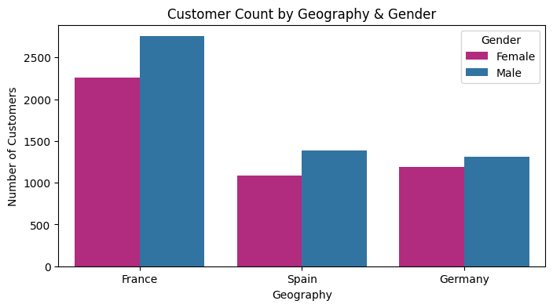
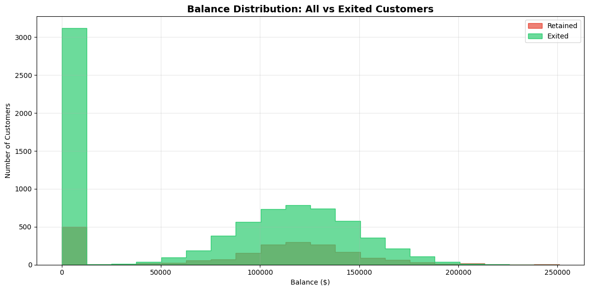
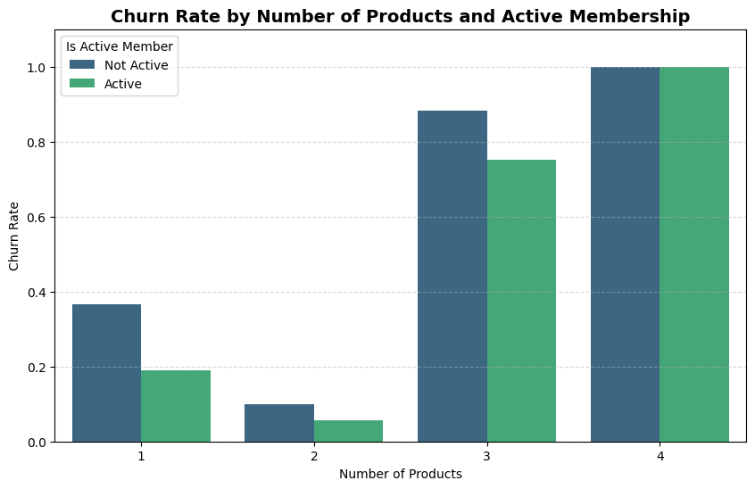
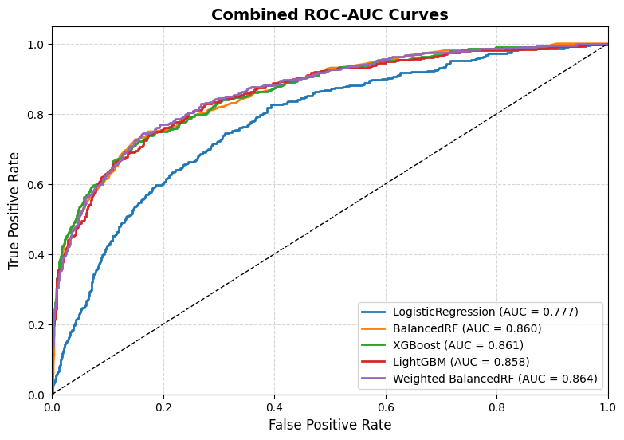
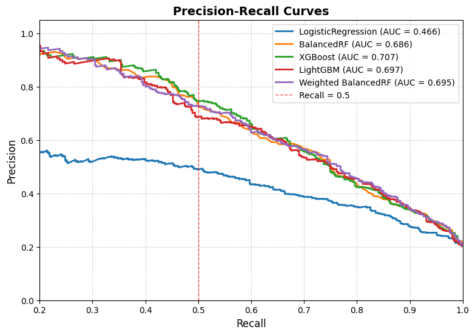

# Banking Customer Churn Prediction

**Goal:** Predict which bank customers are likely to leave (churn) based on demographic and account-related features.  
Built with Python and modern ML tools to explore, visualize, and model customer behavior.

---
## Dataset

The dataset used in this project is available on [Kaggle](<https://www.kaggle.com/datasets/mathchi/churn-for-bank-customers?resource=download&select=churn.csv>).  
Originally published by **Mehmet Akturk**.  
It contains customer demographic and account-related information used to predict churn behavior.

---

## Project Overview

Customer retention is crucial in the banking sector.  
This project analyzes customer data and builds machine learning models to identify clients at risk of churning — helping banks take proactive retention steps.

---

## Tools and Libraries

- Python  
- pandas, NumPy, matplotlib, seaborn  
- scikit-learn  
- XGBoost, LightGBM  
- imbalanced-learn (Balanced Random Forest)  
- SHAP (model explainability)  
- Optuna (hyperparameter tuning)

---

## Notebooks

| Notebook | Description |
|-----------|--------------|
| `BankingChurn_EDA.ipynb` | Exploratory data analysis, feature visualization, and data preprocessing. |
| `BankingChurn_Models.ipynb` | Model training, tuning, and evaluation across four algorithms. |

---

## Exploratory Data Analysis (EDA)

**Key Findings:**

- **Active membership** shows a strong link to retention — inactive customers churn almost twice as often as active ones.  
- **Country, age, and gender** also matter: churn is highest in **Germany**, peaks among customers aged **46–65**, and is notably higher among **women**.

**Factors with little or no clear influence:**

- **Balance**, **credit score**, **tenure**, **salary**, and **credit card ownership** all show stable churn rates around 20%, indicating minimal predictive power.

**Next Step:**

- In the modeling phase, especially when interpreting **SHAP values** and **feature importances**, we verify whether the model also identifies these behavioral and demographic factors as the most influential for predicting churn.

---

## Models Compared

| Model | AUC-ROC | Key Insight |
|--------|----------|--------------|
| Logistic Regression | ~0.77 | Baseline model, interpretable but limited recall. Precision for key class is very low - ~0.39 |
| **Balanced Random Forest** | **~0.85 (best recall)** | Best recall across al models, minimal false negatives. After hyperparameter tuning and class weights tuning, we were able to get ~0.80 on recall, but 0.10 less on precission. Desition depends on marketing tactics to prevent leaving the bank and how agressive they'll be. |
| XGBoost | ~0.86 | Slightly higher AUC, but more false negatives. Recall for churn class is 0.49, which is almost guesing. |
| LightGBM | ~0.86 | Similar trend to XGBoost, good precision but even lower recall - 0.46. |

> **Why Balanced RF wins:**  
> It achieved the best balance between sensitivity (recall) and stability, making it more reliable for detecting potential churners — even at the cost of slightly lower precision.

---

## Key Insights

- Feature engineering and SMOTE were tested but **decreased performance by 3–4%**, so the final model used the original data balance.  
- Most churners shared patterns in **credit score**, **tenure**, and **geography**.  
- Visual analysis highlighted differences in customer age and account balance.

---

## Visual Highlights

### Customer count by Geography & Gender
 

### Balance Distribution
 

### Churn Rate by Number of Products and Active Member
 

### Combined ROC-AUC Curves
 

### Precision Recall Curves
 

